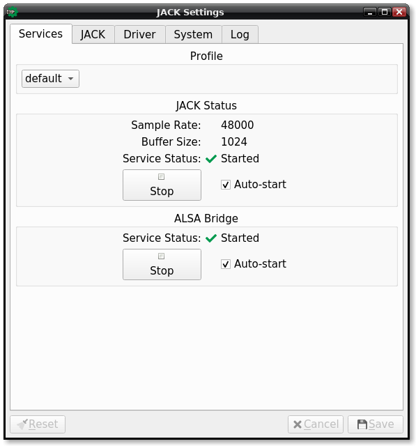

# JACK Settings

[![Travis Build Status]](https://travis-ci.com/azdrums/JACKSettings)

Configure a JACK server started as a `jackdmp` user [systemd service].

This application uses the [CLI11 command line parser].

## Installation

- copy `systemd/a2jmidid@.service` into `/usr/lib/systemd/user`
  (same directory where `jack@.service` is installed)

[Travis Build Status]:       https://img.shields.io/travis/com/redtide/JACKSettings.svg?label=Linux&style=popout&logo=travis
[systemd service]:           https://github.com/jackaudio/jack2/tree/master/systemd
[CLI11 command line parser]: https://github.com/CLIUtils/CLI11
